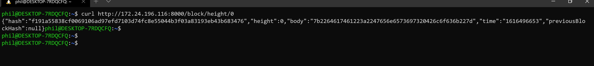
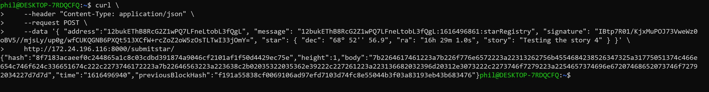
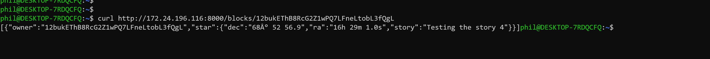

# Project: Private Block Chain Application

#### Author: Phillip Young

The screen shots below illustrate successful execution of the private block chain application, for registration of star ownership on the bitcoin network. 

1. Launch the application, from the terminal (inside Visual Studio Code)

2. Request block at height 0, to test creation of the genesis block

3. Request creation of a message that can be signed

4. Sign the message with an Electrum wallet

5. Submit the star data, along with the signed message, within 5 minutes

6. Get blocks visible to the wallet address

7. Get blocks visible at height 1 

8. Get the block using it's hash

9. Get validateChain, to force validation and return the result

